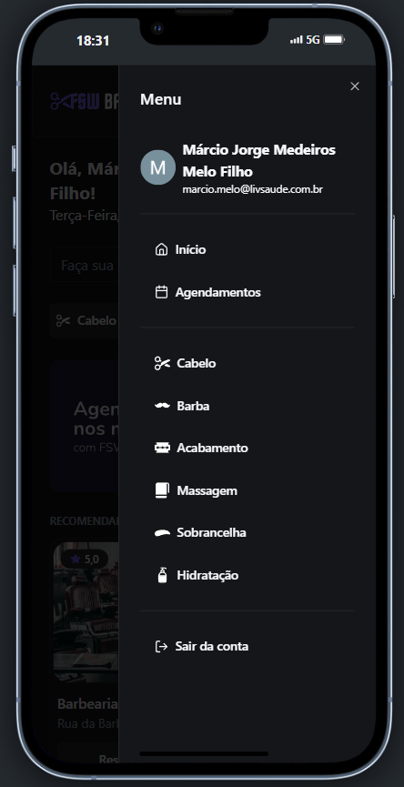

# FSW Barber


O **FSW Barber** é uma aplicação web completa para agendamento de serviços em barbearias, permitindo que usuários encontrem estabelecimentos, consultem horários disponíveis em tempo real e realizem agendamentos online com praticidade. Desenvolvido com _Next.js, TypeScript, Tailwind CSS, Prisma, PostgreSQL_ e autenticação via _NextAuth_, o sistema oferece uma interface moderna e responsiva, painel de gestão para as barbearias, **login com Google** e integração com o _Cloudinary_ para gerenciamento de imagens. É uma solução escalável, com foco em usabilidade, performance e acessibilidade.

## Sumário

1. [Visão Geral do Projeto](#visão-geral-do-projeto-funcionalidades-principais)
   - [Perfil público com informações e horários disponíveis](#1-perfil-público-com-informações-e-horários-disponíveis)
   - [Agendamento de horários em tempo real](#2-agendamento-de-horários-em-tempo-real)
   - [Área do cliente com histórico de agendamentos](#3-área-do-cliente-com-histórico-de-agendamentos)
   - [Login com Google](#4-login-com-google)
2. [Tecnologias Utilizadas](#tecnologias-utilizadas-linguagens-e-ferramentas)
3. [Screenshots](#screenshots)
   - [Mobile](#mobile)
4. [Requisitos para Rodar o Projeto Localmente](#requisitos-para-rodar-o-projeto-localmente)
5. [Rodar o Projeto Localmente](#rodar-o-projeto-localmente)
6. [Autores](#autores)
7. [Licença](#licença)

## Visão Geral do Projeto (Funcionalidades Principais)

### 1. Perfil público com informações e horários disponíveis:

- Cada barbearia cadastrada possui uma página pública acessível por qualquer usuário. Nessa página, é possível visualizar os detalhes do estabelecimento, fotos, serviços prestados, horários disponíveis para agendamento e uma interface amigável para escolher e reservar um horário.

### 2. Agendamento de horários em tempo real:

- Os usuários podem agendar serviços diretamente pelo perfil da barbearia, visualizando os horários disponíveis em tempo real. Uma vez selecionado o horário, o sistema bloqueia automaticamente aquele slot para evitar conflitos ou agendamentos duplicados.

### 3. Área do cliente com histórico de agendamentos:

- Cada cliente autenticado possui uma área pessoal onde pode consultar todos os agendamentos feitos, conferir datas, horários e serviços solicitados. Também é possível visualizar detalhes do atendimento ou cancelar o agendamento com antecedência.

### 4. Login com Google:

- A autenticação é feita com segurança via NextAuth, permitindo que o usuário entre na plataforma utilizando sua conta Google. Isso garante praticidade, confiabilidade e uma experiência de login rápida.

## Tecnologias Utilizadas (Linguagens e ferramentas)

<table>
    <tr>
      <td align="center">
        <a href="https://nextjs.org/">
          
          <br />
          <sub>
            <b>Next.JS</b>
          </sub>
        </a>
      </td>
      <td align="center">
        <a href="https://tailwindcss.com/">
          
          <br />
          <sub>
            <b>TailwindCSS</b>
          </sub>
        </a>
      </td>
      <td align="center">
        <a href="https://www.typescriptlang.org/">
          
          <br />
          <sub>
            <b>TypeScript</b>
          </sub>
        </a>
      </td>
    </tr>
</table>
<table border-style="none">
  <tr>
    <td align="center">
      <a href="https://www.postgresql.org/">
        <br />
        <sub>
          <b>Postgres</b>
        </sub>
      </a>
    </td>
    <td align="center">
      <a href="https://www.prisma.io/?via=start&gad_source=1&gclid=CjwKCAiAh6y9BhBREiwApBLHC9l2TMrWhYJPi787DeRP5SCnQp6MnosFLDKIvTfWJ9IoUl684SdROhoCrTUQAvD_BwE">
        <br />
        <sub>
          <b>Prisma</b>
        </sub>
      </a>
    </td>
    <td align="center">
      <a href="https://cloudinary.com/">
        <br />
        <sub>
          <b>Cloudinary</b>
        </sub>
      </a>
    </td>
    <td align="center">
      <a href="https://neon.tech/">
        <br />
        <sub>
          <b>Neon-Postgres</b>
        </sub>
      </a>
    </td>
    <td align="center">
      <a href="https://git-scm.com/">
        <br />
        <sub>
          <b>Git</b>
        </sub>
      </a>
    </td>
  </tr>
</table>

## Screenshots

### Mobile





## Requisitos para Rodar o Projeto Localmente

### Node.js e npm:

- Verifique se você tem o Node.js instalado. Caso contrário, faça o download e instale a versão mais recente do Node.js.
- O npm (Node Package Manager) é instalado automaticamente com o Node.js.

### Git:

- Certifique-se de ter o Git instalado em sua máquina. Se não tiver, você pode baixá-lo aqui.

### Editor de Texto ou IDE:

- Escolha um editor de texto ou uma IDE (Ambiente de Desenvolvimento Integrado) para trabalhar no código. Alguns exemplos populares incluem o Visual Studio Code, Sublime Text e Atom.

### Navegador Web:

- Você precisará de um navegador web para visualizar o aplicativo localmente. Recomendamos o uso do Google Chrome, Mozilla Firefox ou Microsoft Edge.

### Configuração dos sistemas externos:

- Necessita realizar toda a configuração do Prisma, Postgres e Cloudinary.

## Rodar o Projeto Localmente

**Clone o projeto**

```bash
  git clone https://github.com/MarcioJorgeMelo/FSW-dev-barber.git
```

**Vá para a pasta do projeto**

```bash
  cd fsw-barber
```

**Abra o projeto no VSCode**

```bash
  code .
```

**Instale as dependências de cada aplicação**

```bash
  npm install # Instala as dependências (se ainda não tiver feito)
```

```bash
  npx prisma generate
```

**Rode os projetos**

```bash
  npm run dev
```

## Autores

- [@MarcioJorgeMelo](https://github.com/MarcioJorgeMelo)

## Licença

- [MIT](https://choosealicense.com/licenses/mit/)
